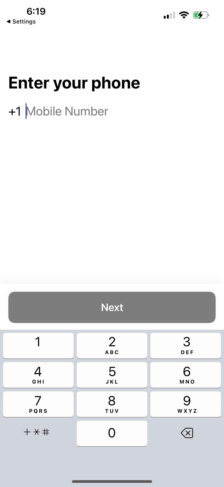
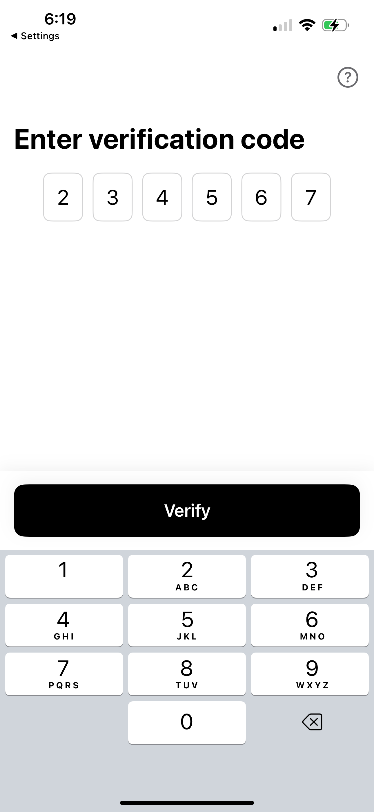
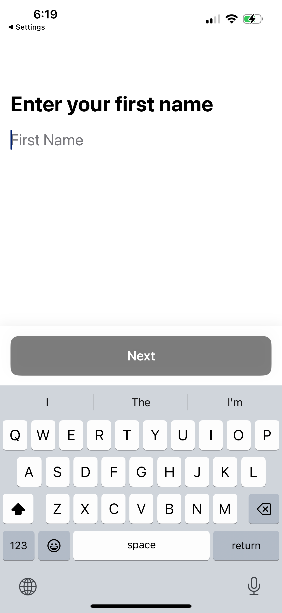
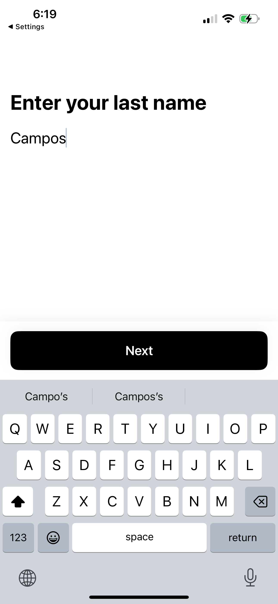
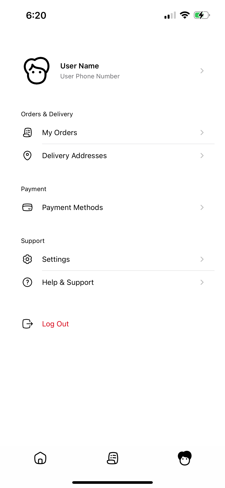
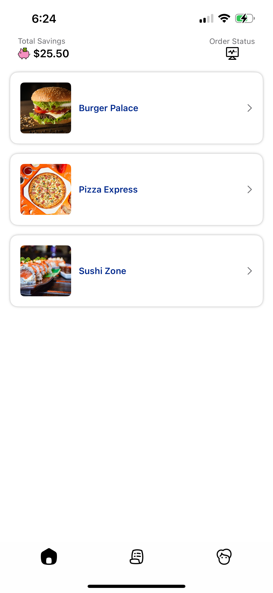
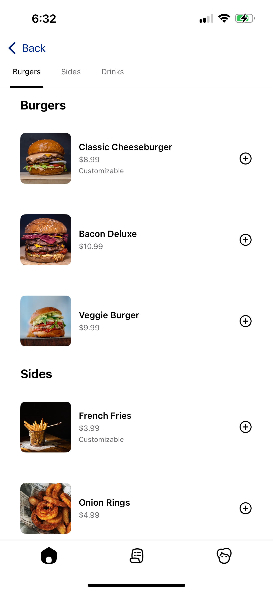
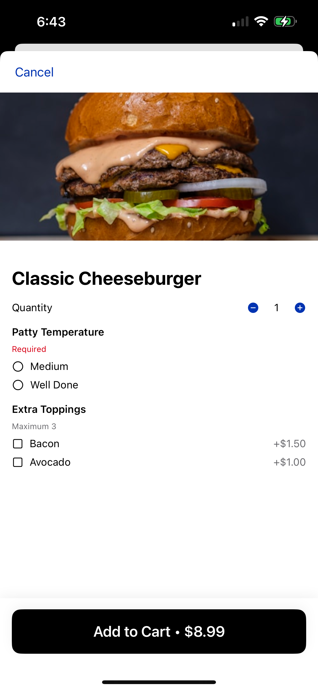
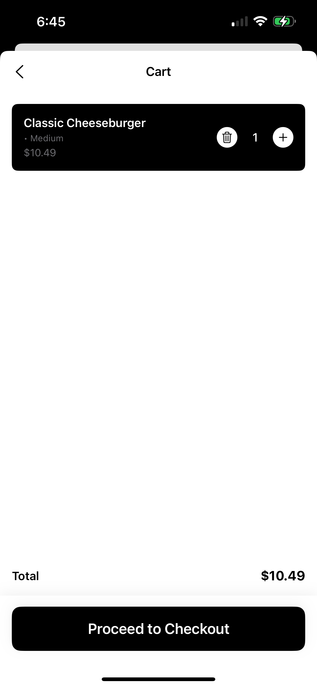
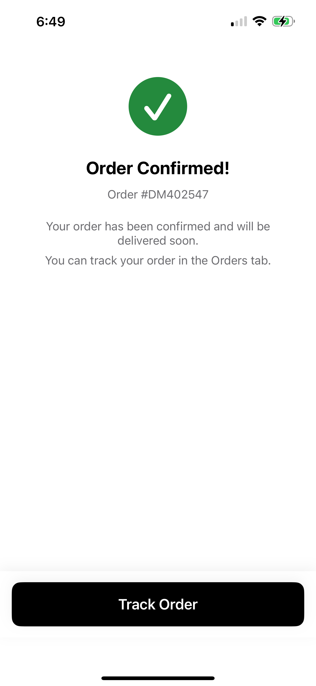

# DormealApp 🍔

  

## About

DormealApp is a modern iOS food delivery platform designed for college campuses. It connects students with campus food carriers, creating a seamless food delivery experience within the university ecosystem.

## Screenshots

Here's a glimpse of Dormeal, with a LOT more in the codebase:

  
  
  
  
  
  
  
  
  
  
  

## Tech Stack & Tools

### Core Technologies
- **Swift & SwiftUI**: Modern declarative UI framework
- **Rive Runtime**: For smooth animations and interactions
- **MVVM Architecture**: For clean code separation and maintainability

### Development Tools
- Xcode 15+
- iOS 15.0+ SDK
- Asset Catalog for resource management

### Key Features
- Custom navigation system
- Real-time order tracking
- Carrier onboarding flow
- Profile management
- Payment integration

### Design
- Custom UI components
- Unified icon system
- Light mode optimized
- Responsive layouts

---

Built for campus communities 🎓

 
